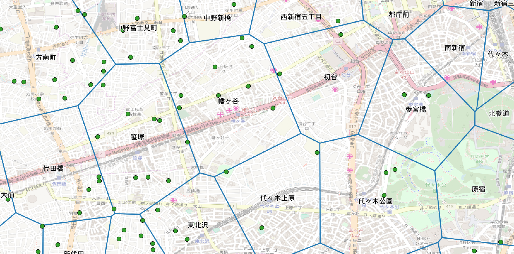
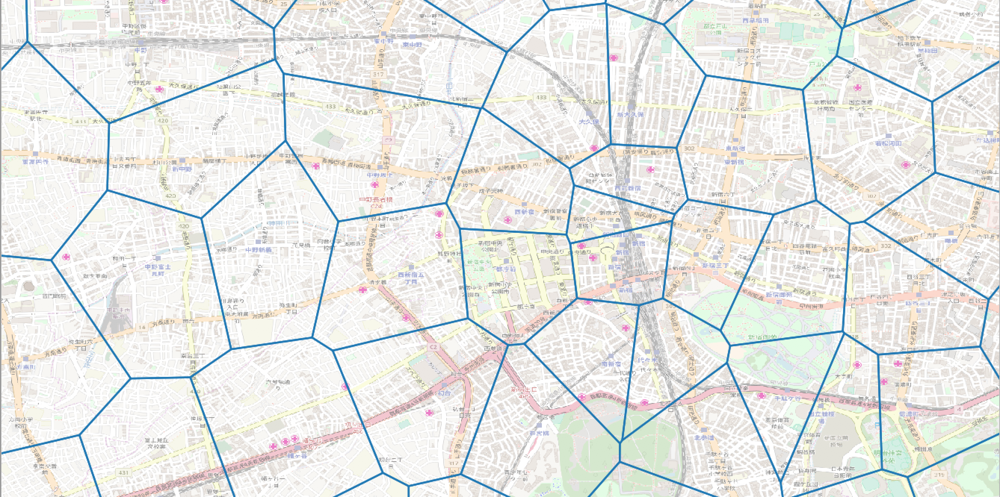
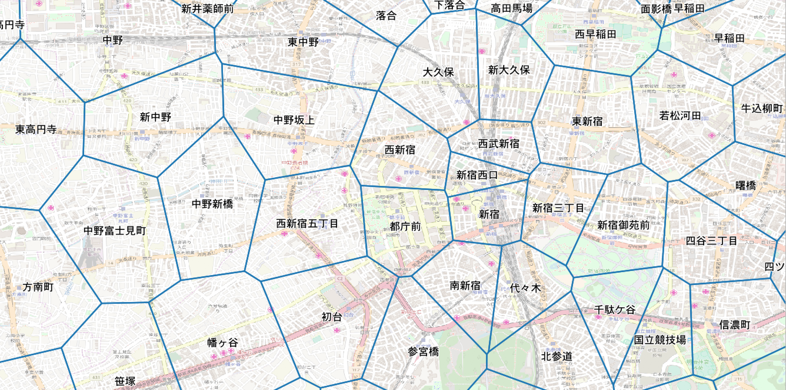
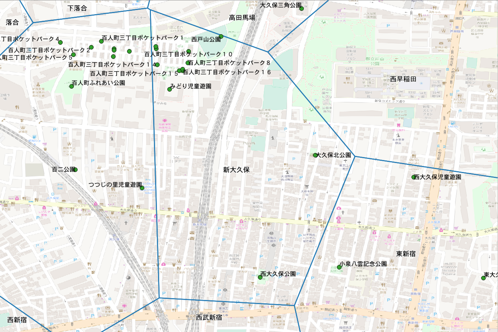
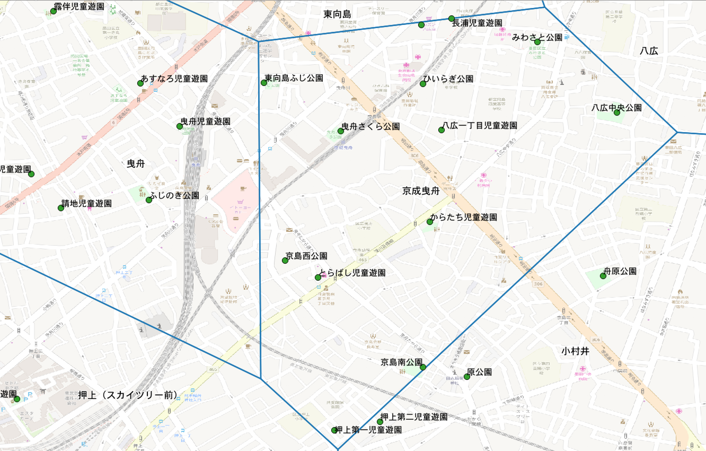
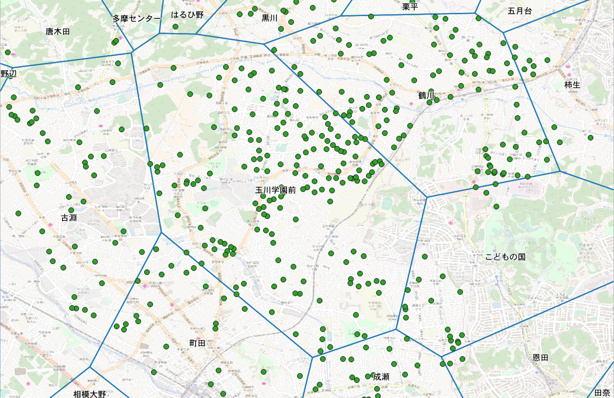

# この発表について
- PostgreSQLには便利な機能がたくさんあります。業務の中で「これできないかな？」と思って調べると関数や拡張が用意されていた、ということも多々ありました。ActiveRecordおよび標準SQLを使って仕事をしていると見えてこない「レールの外」のPostgreSQLの世界をご紹介しようと思います。
- PostgreSQLの便利な機能をそれぞれユースケースを交えて解説します。
- 原則、AWS RDS、Google Cloud SQL for PosterSQLで使える機能のみ紹介します。
- 利用したPostgreSQLのバージョンは10.1、PostGISのバージョンは2.4.3です。
- 発表で登場するコード例は https://github.com/fujimura/railsdm_2018_postgresql にあります。

# 自己紹介

藤村大介


ご近所SNSマチマチを運営する株式会社マチマチのCTO。Railsは2.2位から仕事で使っている。フロントエンド開発も得意。

- twitter.com/ffu_
- fujimuradaisuke.com

SQL歴は足掛け10年程度。PostgreSQL歴は4年程度。内部構造の詳しい知識などはありません。

# マチマチについて（1）


# マチマチについて（2）

## チーム
 @fujimura
 @knu
 @imaz（フリーランス）

## テクノロジー
- バックエンド：Rails, PostgreSQL
- フロントエンド：React, Flowtype
- ネイティブアプリ：これからReact Nativeで作る

<b>エンジニア募集中です！藤村まで気軽にお声かけ下さい。</b>

# Window関数（1）

最近MySQLにも入ったWindow関数ですが皆さん使っていますか？データ分析ではよく使いますが、アプリケーション開発ではあまり使わないかもしれません。

# Window関数（1）やりたいこと

このテーブルの各行の`position`を重複なしタイムスタンプ順で振りなおしたい

<pre>
  name | position |         updated_at
------+----------+----------------------------
 A    |        1 | 2018-03-21 22:17:49.215978
 B    |        2 | 2018-03-21 22:17:49.215978
 F    |        <span style='color: red'>3</span> | <span style='color: red'>2018-03-23</span> 10:17:49.220138
 C    |        <span style='color: red'>3</span> | <span style='color: red'>2018-03-21</span> 22:17:49.215978
 D    |        4 | 2018-03-21 22:17:49.215978
 E    |        5 | 2018-03-21 22:17:49.215978
</pre>

# Window関数（1）そもそもWindow関数とは

Window関数は「現在の行」の情報を使った値を計算する機能です。例えば`ROW_NUMBER`を使うと、特定のカラムでソートした際の現在の行番号がわかります。

例えばさきほどのテーブルにこのクエリを実行すると

```sql
SELECT name, position,
       ROW_NUMBER() OVER ( ORDER BY position, updated_at DESC) AS i
FROM categories;
```

`position`、`updated_at`の順にソートした場合の行番号が取得できます。

<pre>
 name | position | i |         updated_at
------+----------+---+----------------------------
 A    |        1 | <span style='color: red'>1</span> | 2018-03-21 22:17:49.215978
 B    |        2 | <span style='color: red'>2</span> | 2018-03-21 22:17:49.215978
 F    |        3 | <span style='color: red'>3</span> | 2018-03-21 22:17:49.215978
 C    |        3 | <span style='color: red'>4</span> | 2018-03-21 22:17:49.215978
 D    |        4 | <span style='color: red'>5</span> | 2018-03-21 22:17:49.215978
 E    |        5 | <span style='color: red'>6</span> | 2018-03-21 22:17:49.215978
</pre>

# Window関数（1）`position`を振り直す
実際に`position`を振り直すには、下記のSQLを実行します。新たに`position`を振った表をWindow関数を使って用意して、それを元のテーブルと結合してUPDATEしています。

```sql
UPDATE categories
SET POSITION = c.row_number
FROM
  (SELECT name,
          ROW_NUMBER() OVER (ORDER BY POSITION, updated_at DESC) AS row_number
   FROM categories) AS c
WHERE c.name = categories.name;
```

<pre>
 name | position |         updated_at
------+----------+----------------------------
 A    |        1 | 2018-03-21 22:17:49.215978
 B    |        2 | 2018-03-21 22:17:49.215978
 F    |        3 | 2018-03-23 10:17:49.220138
 C    |        <span style='color:red'>4</span> | 2018-03-21 22:17:49.215978
 D    |        <span style='color:red'>5</span> | 2018-03-21 22:17:49.215978
 E    |        <span style='color:red'>6</span> | 2018-03-21 22:17:49.215978
</pre>

# Window関数(2)やりたいこと

アクセスログから30分以内の連続したアクセスを一つのセッションとして、セッションの一覧を出したい。

# Window関数(2)アクセスログのデータ
ユーザーIDとして`id`、タイムスタンプとして`time`を持った簡単なログテーブルがあるとします。

```
 id |            time
----+----------------------------
  1 | 2018-03-10 06:14:06.265533
  1 | 2018-03-10 07:04:06.265533
  2 | 2018-03-10 07:31:06.265533
  1 | 2018-03-10 07:35:06.265533
  2 | 2018-03-10 08:02:06.265533
  2 | 2018-03-10 08:03:06.265533
  2 | 2018-03-10 08:04:06.265533
  1 | 2018-03-10 08:05:06.265533
  2 | 2018-03-10 08:14:06.265533
  1 | 2018-03-10 08:14:06.265533
``` 

# Window関数(2)現在の行と前の行の差を取得

`LAG`で前の行が取得できます。この例では`id`ごとに前の行の`time`を取得、現在の行の`time`との差を求めています。

```sql
SELECT
  id,
  time as current_row,
  LAG(time) OVER (PARTITION BY id ORDER BY time) as previous_row,
  (time - (LAG(time) OVER (PARTITION BY id ORDER BY time))) / 60 as difference
FROM access_logs
ORDER BY id, current_row ASC
```

<pre>
 id |        current_row         |        previous_row        | difference
----+----------------------------+----------------------------+------------
  1 | <span style='color:red'>2018-03-10 06:14:06.265533</span> | ¤                          | ¤
  1 | <span style='color:green'>2018-03-10 07:04:06.265533</span> | <span style='color:red'>2018-03-10 06:14:06.265533</span> | 00:00:50
  1 | <span style='color:purple'>2018-03-10 07:35:06.265533</span> | <span style='color:green'>2018-03-10 07:04:06.265533</span> | 00:00:31
  1 | 2018-03-10 08:05:06.265533 | <span style='color:purple'>2018-03-10 07:35:06.265533</span> | 00:00:30
  1 | 2018-03-10 08:14:06.265533 | 2018-03-10 08:05:06.265533 | 00:00:09
  2 | 2018-03-10 07:31:06.265533 | ¤                          | ¤
  2 | 2018-03-10 08:02:06.265533 | 2018-03-10 07:31:06.265533 | 00:00:31
  2 | 2018-03-10 08:03:06.265533 | 2018-03-10 08:02:06.265533 | 00:00:01
  2 | 2018-03-10 08:04:06.265533 | 2018-03-10 08:03:06.265533 | 00:00:01
  2 | 2018-03-10 08:14:06.265533 | 2018-03-10 08:04:06.265533 | 00:00:10 
</pre>

# Window関数(2)セッション一覧

さきほどのSQLより、前回との差がNULL（初回アクセス）、前回との差が30分以上（新しいセッション）の行を取得すると、セッション一覧になります。

```sql
SELECT
 id, s.time as timestamp
FROM (
  SELECT
    CASE
      WHEN LAG(time) OVER (PARTITION BY id ORDER BY time) IS NULL THEN time
      WHEN EXTRACT(epoch FROM time - (LAG(time) OVER (PARTITION BY id ORDER BY time))) > 60 * 30 THEN time
      ELSE NULL
    END AS time,
    id
  FROM
    access_logs
  ORDER BY
    time ) as s
WHERE
  time IS NOT NULL
  order by timestamp, id
```

# Window関数(2)セッション一覧

<pre>
 id |        current_row         |        previous_row        | difference
----+----------------------------+----------------------------+------------
  1 | 2018-03-10 06:14:06.265533 | ¤                          | <span style='color:red'>¤</span>
  1 | 2018-03-10 07:04:06.265533 | 2018-03-10 06:14:06.265533 | <span style='color:red'>00:00:50</span>
  1 | 2018-03-10 07:35:06.265533 | 2018-03-10 07:04:06.265533 | <span style='color:red'>00:00:31</span>
  1 | 2018-03-10 08:05:06.265533 | 2018-03-10 07:35:06.265533 | 00:00:30
  1 | 2018-03-10 08:14:06.265533 | 2018-03-10 08:05:06.265533 | 00:00:09
  2 | 2018-03-10 07:31:06.265533 | ¤                          | <span style='color:red'>¤</span>
  2 | 2018-03-10 08:02:06.265533 | 2018-03-10 07:31:06.265533 | <span style='color:red'>00:00:31</span>
  2 | 2018-03-10 08:03:06.265533 | 2018-03-10 08:02:06.265533 | 00:00:01
  2 | 2018-03-10 08:04:06.265533 | 2018-03-10 08:03:06.265533 | 00:00:01
  2 | 2018-03-10 08:14:06.265533 | 2018-03-10 08:04:06.265533 | 00:00:10
</pre>

<pre>
 id |         timestamp
----+----------------------------
  1 | 2018-03-10 06:14:06.265533
  1 | 2018-03-10 07:04:06.265533
  2 | 2018-03-10 07:31:06.265533
  1 | 2018-03-10 07:35:06.265533
  2 | 2018-03-10 08:02:06.265533
</pre>

# Window関数 Railsでは？

- `ActiveRecord::Connection.execute`
- `ActiveRecord::Querying#find_by_sql`
- `ActiveRecord::QueryMethods#select`

# Trigger

PostgreSQLではTriggerという仕組みを使って、行への操作（挿入・更新・削除）があった時に特定の関数を実行することができます。

# Trigger - やりたいこと

テーブルの変更履歴をアプリケーション側ではなくデータベース側のみで自動で記録したい。


# Trigger - とは？

公式ドキュメントによると、

> CREATE TRIGGERは新しいトリガを作成します。 作成したトリガは指定したテーブルまたはビューと関連付けられ、特定のイベントが発生した時に指定した関数function_nameを実行します

https://www.postgresql.jp/document/10/html/sql-createtrigger.html

とのこと。

関数はPL/pgSQLという手続き型プログラミング言語で記述し、コードの中にSQLを書いて行の操作をすることができます。

# Trigger - レコードの変更をJSONで保存するトリガーの関数を定義する

下記のトリガーでレコードに更新があった際に`changes`というテーブルに変更を保存します。変更前、変更後の行を`OLD`と`NEW`で参照することができるので、それを`row_to_json`でJSONに変換して保存しています。

```sql
CREATE OR REPLACE FUNCTION audit_changes() RETURNS trigger
    LANGUAGE plpgsql
    AS $$
BEGIN
  IF (TG_OP = 'UPDATE') THEN
    INSERT INTO changes (table_name, operation, old_content, new_content, created_at)
      VALUES (TG_TABLE_NAME, TG_OP, row_to_json(OLD), row_to_json(NEW), now());
    RETURN NEW;
  END IF;
END;
$$;   
```
# Trigger - トリガーをテーブルに適用する

`CREATE TRIGGER`でトリガーをテーブルに適用します。

```sql
CREATE TRIGGER audit_items_changes BEFORE UPDATE ON items FOR EACH ROW EXECUTE PROCEDURE audit_changes();
```

# Trigger - 実行結果

このテーブルを
```
   name    | type
-----------+-------
 Apple     | Fruit
 Wine      | Drink
 Beer      | Drink
 Chocolate | Food
```

変更すると
```
UPDATE items SET name = 'Orange' WHERE name = 'Apple';
```

履歴が保存されます。
```
 table_name | operation |    old_content    |    new_content     |         created_at
------------+-----------+-------------------+--------------------+----------------------------
 items      | UPDATE    | {"name": "Apple", | {"name": "Orange", | 2018-03-10 09:27:05.213614
            |           |  "type": "Fruit"} |  "type": "Fruit"}  |
```

# Trigger - Railsでは？

- マイグレーション内で`ActiveRecord::Connection.execute`

# Materialized view

要はキャッシュされたビューです。

# Materialized view - やりたいこと

下記のように、「ワイン」テーブルと「ビール」テーブルがあるとします。これを「飲み物」テーブルとして横断して検索したくなりました。

```sql
CREATE EXTENSION pgcrypto; -- gen_random_uuid()のために必要

CREATE TABLE wines (
  id uuid DEFAULT gen_random_uuid() NOT NULL,
  name varchar,
  color varchar,
  price integer
);

CREATE TABLE beers (
  id uuid DEFAULT gen_random_uuid() NOT NULL,
  name varchar,
  type varchar,
  price integer
);
```

# Materialized view - そもそもビューとは？

ビューはSELECT文を保存してあたかもテーブルかのように扱える機能です。

# Materialized view - とは？

通常のビューは毎回その定義のSELECT文を実行します。マテリアライズド・ビューは通常のビューとは違い、SELECT文の結果が保存されます。

結果が保存されているので通常のビューよりも多くの場合高速ですが、データの更新は手動で行う必要があります。また、インデックスを貼ることも可能です。

# Materialized view - テーブル定義

「ワイン」テーブルと「ビール」テーブルをまとめた、「飲み物」マテリアライズド・ビューを定義してみましょう。

# Materialized view - テーブル定義（おさらい）

改めて先程の「ワイン」テーブルと「ビール」テーブルの定義です。

```sql
CREATE TABLE wines (
  id uuid DEFAULT gen_random_uuid() NOT NULL,
  name varchar,
  color varchar,
  price integer
);

CREATE TABLE beers (
  id uuid DEFAULT gen_random_uuid() NOT NULL,
  name varchar,
  type varchar,
  price integer
);
```

# Materialized view - マテリアライズド・ビューの定義

「ワイン」テーブルと「ビール」テーブルの型を揃えて`UNION`したものを「飲み物」ビューとして定義します。

`beverages.id`の型はUUIDなので重複がありません。なのでユニークインデックスを貼ることができます。

```sql
CREATE MATERIALIZED VIEW beverages AS
  SELECT w.id AS id,
  w.name AS name,
  w.price AS price,
  'wines' AS type
  FROM wines AS w
UNION ALL
  SELECT b.id AS id,
  b.name AS name,
  b.price AS price,
  'beers' AS type
  FROM beers AS b
;

CREATE UNIQUE INDEX index_beverages_id ON beverages USING btree (id);
```

# Materialized view - データ投入、更新

データを投入した後、`REFRESH MATERIALIZED VIEW`でデータを更新します。ユニークインデックスがあると`CONCURRENTLY`オプションを使うことができます。これを指定すると更新中のビューへの読み込みロックが回避できます。

```sql
INSERT INTO wines
(name, color, price)
VALUES
('Rotten Highway', 'White', 10000),
('yellow tail Chardonnay', 'White', 1000)
;

INSERT INTO beers
(name, type, price)
VALUES
('Old Rasputin', 'Imperial Stout', 1300),
('Ichiban Shibori', 'Lager', 300)
;

REFRESH MATERIALIZED VIEW CONCURRENTLY beverages;
```

# Materialized view - 飲み物ビューを検索

マテリアライズド・ビューを使って1000円以下の「ビール」と「ワイン」を一度に検索することができました😇

```sql
SELECT * FROM beverages
WHERE price <= 1000;  
```

```
                  id                  |          name          | price | type
--------------------------------------+------------------------+-------+-------
 1f17edd2-f3df-4cd7-b72e-faff06df6130 | Ichiban Shibori        |   300 | beers
 73afb8eb-9f6f-4e1c-a3ef-5f4ee36ff3af | yellow tail Chardonnay |  1000 | wines
```

# Materialized view - Railsでは？

- https://github.com/thoughtbot/scenic でマイグレーションとして管理できます。とても便利！

# Materialized view - 補足

- ディスクスペースが必要になる、リフレッシュが必要、リフレッシュのコストがかかるというデメリットがあります。詳しくは https://www.slideshare.net/SoudaiSone/postgre-sql-54919575 を参照ください。
	- 個人的には 1) リフレッシュが遅れても問題なく 2) 更新頻度が低い 場合のみマテリアライズド・ビュー使用可としています。
- ソースとなるテーブルの主キー（`id`）をRailsでよくあるincremental idにするとビューで主キー（的なもの）が作れません。
	- キーが衝突するのでユニークインデックスが貼れないのでリフレッシュ時に`CONCURRENTLY`オプションが使えず、更新中にソースとなっているテーブルにロックがかかってしまいます。
	- `id`をUUIDにするとこれを回避できます。
	- ちなみにRails 5からActiveRecordでprimary keyをUUIDにできるようになりました。詳しく http://blog.bigbinary.com/2016/04/04/rails-5-provides-application-config-to-use-UUID-as-primary-key.html を参照ください。

# PostGIS

# PostGIS - やりたいこと

東京都の近くに公園が多い駅ランキングを出したい。

# PostGIS - って何？

地理空間情報を扱うための拡張です。そもそも地理空間情報って何？という問いについては、これからお話しする実例を通してお答えできればと思います。

PostGISが具体的に提供する機能としては、1) ジオメトリカラムの定義 2) ジオメトリ関数 の2つです。

ジオメトリは点、線、面など、空間上を占める何らかの情報のことです。

# PostGIS - 例

駅のテーブル（`stations`、定義はのちほど）を使って、代々木公園駅から距離が近い駅ランキングを出してみましょう。
下記のように`ST_Distance_Sphere`で二点間の距離を出すことができます。

```sql
SELECT s1.name, s2.name,
       ST_Distance_Sphere(s1.geom, s2.geom) AS distance
FROM stations s1
CROSS JOIN stations s2
WHERE s1.name = '代々木公園' AND s1.name <> s2.name
ORDER BY distance
LIMIT 5;
```

```
+------------+------------+------------+
| name       | name       | distance   |
|------------+------------+------------|
| 代々木公園 | 代々木上原 | 0.00894604 |
| 代々木公園 | 参宮橋     | 0.0104074  |
| 代々木公園 | 駒場東大前 | 0.0115478  |
| 代々木公園 | 初台       | 0.0123519  |
| 代々木公園 | 神泉       | 0.0127556  |
+------------+------------+------------+
 ```

# PostGIS - 公園が多い駅ランキングを出すにあたっての戦略

「駅の最寄りエリア」の面を作って、その中にある公園を数えるという方向で挑みます。



# PostGIS - テーブル定義

`geometry(Point, 4326)`※ という設定で空間上の「点」を表すジオメトリ型のカラムを定義できます。要は緯度経度です。`geometry(Polygon, 4326)`でポリゴン、つまり「面」を定義できます。

公園(`parks`)には`geom`として公園を代表する地点を、駅（`stations`）には`geom`として駅の地点、`nearby`として最寄りエリアを定義しました。

```sql
CREATE EXTENSION postgis;

CREATE TABLE parks (
  prefecture varchar,
  city varchar,
  name varchar,
  type varchar,
  geom geometry(Point, 4326)
);

CREATE TABLE stations  (
  code integer,
  name varchar,
  prefecture_code integer,
  address varchar,
  geom geometry(Point, 4326),
  nearby geometry(Polygon, 4326)
);
```
<span style='font-size:50%'>※: `4326`って何？と思う方へ: 緯度経度の測り方は何種類もあって、それぞれ測地系と呼ばれています。`4326`は世界測地系WGS84というよく使われている測地系を表すコードです。</span>

# PostGIS - 「駅の最寄りエリア」テーブルを作成

平面上にいくつか点があって、その平面を「どの点に一番近いか」で分割した図がボロノイ図です。これを使うと「最寄りエリア」のポリゴンを作れます。
下記のように駅の地点を使ってボロノイ図を描画し、それを最寄りエリアテーブル（`polygons`）として保存します。


```sql
CREATE TABLE polygons (geom geometry(Polygon, 4326));
CREATE INDEX index_polygons_geom ON polygons USING gist (geom);

INSERT INTO polygons (geom)
SELECT g.geom
FROM
  (
    SELECT (
      -- ST_Dump: 複数のジオメトリを行に展開する。ボロノイ図は面の集合として返されるので、展開が必要
      ST_Dump(
        -- ST_VoronoiPolygons: 複数のジオメトリ（駅の地点の集合）からボロノイ図を描画する
        ST_VoronoiPolygons(
          -- ST_Union: 複数のジオメトリ（ここでは駅の地点）を一つのジオメトリ（駅の地点の集合）にまとめる
          ST_Union(geom)
        )
      )
    ).geom AS geom
    FROM stations
  ) as g;
```

# PostGIS - 「駅の最寄りエリア」テーブルのイメージ

地図上に表示すると、このように区分けができました。がしかし、これだとどこがどの駅がわかりません。


# PostGIS - 「駅の最寄りエリア」データを駅テーブルに挿入

最寄りエリアにどの駅（の地点）が含まれているかがわかれば、エリアのポリゴンと駅の対応がわかるはず。
PostGISの関数`ST_Contains`で包含関係を判定できるので、これを使って駅テーブルと駅の最寄りエリアテーブルを結合し、更新します。

```sql
UPDATE stations
SET nearby = polygons.geom
FROM polygons
WHERE ST_Contains(polygons.geom, stations.geom);
```

# PostGIS - 「駅の最寄りエリア」と駅の対応ができた！

🎉 🎉 🎉



# PostGIS - 近くに公園が多い駅ランキングを計算

さきほど登場した`ST_Contains`を使って、最寄りエリアに入っている公園を数えます。
ジオメトリの面積を`ST_Area`で求められるので※、それを使って平方キロメートルあたりの公園数を`p_sqkm`として計算しています。

```sql
SELECT stations.name,
       stations.address,
       COUNT(parks.name) p,
       FLOOR(ST_Area(ST_Transform(stations.nearby, 4326)::geography)) area,
       FLOOR(COUNT(parks.name) / ST_Area(ST_Transform(stations.nearby, 4326)::geography) / (1000 * 1000)) p_sqkm
FROM stations
LEFT OUTER JOIN parks ON st_contains(stations.nearby, parks.geom)
WHERE prefecture_code = 13
GROUP BY stations.address, stations.name, stations.nearby
ORDER BY p_sqkm DESC
```
<span style='font-size:50%'>※ メートル単位での計算はジオグラフィ型で行う必要があるので、`ST_Transform`を変換しています。</span>

# PostGIS - 近くに公園が多い駅ランキング

まさかの「新大久保」駅がナンバーワンでした！

```
           name           |               address               |  p  |   area    | p_sqkm
--------------------------+-------------------------------------+-----+-----------+--------
 新大久保                 | 東京都新宿区百人町一丁目10-15       |  12 |    513173 |     23
 京成曳舟                 | 墨田区京島１-３９-１                |  13 |    712581 |     18
 大鳥居                   | 大田区西糀谷３-３７-１８            |  31 |   1638396 |     18
 大森町                   | 大田区大森西３-２４-７              |  25 |   1464670 |     17
 千鳥町                   | 大田区千鳥１-２０-１                |  14 |    844929 |     16
 松陰神社前               | 世田谷区若林４-２１-１６            |  10 |    604776 |     16
 志村三丁目               | 板橋区志村３-２３-１                |  27 |   1615272 |     16
```

# PostGIS - 新大久保駅の様子

結果をビジュアライズしました。ポケットパークという公園が沢山あります。


# PostGIS - 京成曳舟駅の様子

多いような気もします。


# PostGIS - 玉川学園前駅の様子

面積を考慮しない公園の数ではここがトップです。広い。


# PostGIS - Railsでは？

- https://github.com/rgeo/activerecord-postgis-adapter

ジオメトリ型がマイグレーションで定義できます。

```ruby
class CreateStations < ActiveRecord::Migration[5.1]
  def change
    create_table :stations do |t|
      t.string :name
      t.string :line_name
      t.st_point :geom

      t.timestamps
    end

    add_index :welfare_facilities, :geom, using: :gist
  end
end
```

# PostGIS - データの出典とクレジット
- 公園: 国土数値情報 都市公園データ
  - http://nlftp.mlit.go.jp/ksj/gml/datalist/KsjTmplt-P13.html
- 駅: 駅データ.jp
  - http://www.ekidata.jp/
- 地図: OSM Standard on QGIS, ©OpenStreetMap contributors

# まとめ

- PostgreSQLには便利な機能が沢山
- 少しRailsのレールを外れると面白い世界が広がっている
- ご利用は計画的に
